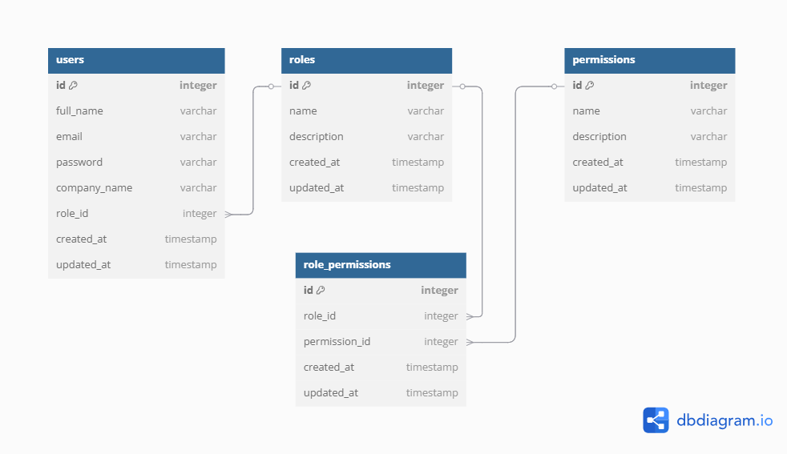

# Project X - Inventory and Checkout System




## Table of Contents
- [Overview](#overview)
- [Features](#features)
- [System Architecture](#system-architecture)
- [API Documentation](#api-documentation)
- [Installation](#installation)
- [Configuration](#configuration)
- [Running the Application](#running-the-application)
- [Testing](#testing)
- [Deployment](#deployment)
- [Troubleshooting](#troubleshooting)
- [Contributing](#contributing)
- [License](#license)

## Overview

**Project X** is a custom inventory and checkout system designed for Shoprite to address declining sales by optimizing inventory management and checkout processing. This SaaS solution offers:

- Multi-user inventory management
- Role-based access control
- Secure checkout processing
- Real-time inventory updates

## Features

### Core Functionality
- ✅ **User Management**
  - Super Admin, Inventory Manager, and Cashier roles
  - Permission-based access control
  - Secure authentication with JWT

- 🛒 **Inventory System**
  - CRUD operations for inventory items
  - Stock quantity tracking
  - SKU management

- 💳 **Checkout Processing**
  - Transaction-based inventory updates
  - Role-restricted access

### Technical Features
- 🔒 **Security**
  - Password hashing with bcrypt
  - Rate limiting
  - CORS protection
  - Helmet security headers

- ⚙️ **Infrastructure**
  - PostgreSQL database
  - Knex.js query builder
  - Transaction management
  - Graceful shutdown

## System Architecture
```
project-x/
├── config/          # Configuration files
├── controllers/     # Business logic
├── middleware/      # Authentication and validation
├── migrations/      # Database schema
├── models/          # Data models
├── routes/          # API endpoints
├── services/        # External services
├── tests/           # Test suites
├── utils/           # Helper functions
├── app.js           # Main application
└── knexfile.js      # Database configuration
```

## API Documentation

Full API documentation is available via Swagger UI at `/api-docs` when running the application locally.

### Key Endpoints

| Endpoint | Method | Description | Required Permissions |
|----------|--------|-------------|----------------------|
| `/api/v1/auth/register` | POST | Register super admin | None |
| `/api/v1/auth/login` | POST | User login | None |
| `/api/v1/users` | POST | Create new user | `user:create` |
| `/api/v1/inventory` | GET | List all items | `inventory:read` |
| `/api/v1/checkout` | POST | Process checkout | `checkout:process` |

## Installation

### Prerequisites
- Node.js 18.x
- PostgreSQL 15.x
- npm 9.x

### Steps
1. Clone the repository:
   ```bash
   git clone https://github.com/yourusername/project-x.git
   cd project-x
   ```
2. Install dependencies:
   ```bash
   npm install
   ```
3. Set up database:
   ```bash
   createdb projectx
   npm run migrate
   ```

## Configuration

Create a `.env` file in the root directory:

```env
# Server
NODE_ENV=development
PORT=5000
FRONTEND_URL=http://localhost:3000

# Database
DB_HOST=localhost
DB_PORT=5432
DB_USER=postgres
DB_PASSWORD=yourpassword
DB_NAME=projectx
DB_SSL=false

# Authentication
JWT_SECRET=your_jwt_secret
JWT_EXPIRES_IN=30d

# Email (for user invites)
EMAIL_SERVICE=sendgrid
EMAIL_USER=your@email.com
EMAIL_PASSWORD=youremailpassword
EMAIL_FROM=noreply@projectx.com
```

## Running the Application

### Development Mode
```bash
npm run dev
```

### Production Mode
```bash
npm start
```

### Environment Variables
The application supports different environments:
- `development` (default)
- `test`
- `production`

Set via `NODE_ENV` environment variable.

## Testing

Run the test suite with:
```bash
npm test
```

Generate a test coverage report:
```bash
npm run test:coverage
```

## Deployment

### Docker
```bash
docker build -t project-x .
docker run -p 5000:5000 --env-file .env project-x
```

### PM2 (Production Process Manager)
```bash
npm install -g pm2
pm start app.js --name project-x
```

## Troubleshooting

### Common Issues
1. **Database Connection Failed**
   - Verify PostgreSQL is running
   - Check `.env` credentials
   - Test connection with `psql`

2. **Role Initialization Errors**
   - Check migration status with `knex migrate:status`
   - Manually verify tables exist in database

3. **Authentication Issues**
   - Verify `JWT_SECRET` is set
   - Check token expiration

### Logs
Application logs are output to:
- Console in development mode
- File-based logs in production (`logs/` directory)

## Contributing

1. Fork the repository
2. Create your feature branch:
   ```bash
   git checkout -b feature/amazing-feature
   ```
3. Commit your changes:
   ```bash
   git commit -m 'Add some amazing feature'
   ```
4. Push to the branch:
   ```bash
   git push origin feature/amazing-feature
   ```
5. Open a Pull Request

## License

This project is licensed under the MIT License - see the [LICENSE](LICENSE) file for details.

---

**Project X** © 2025 - Shoprite Custom Inventory System

